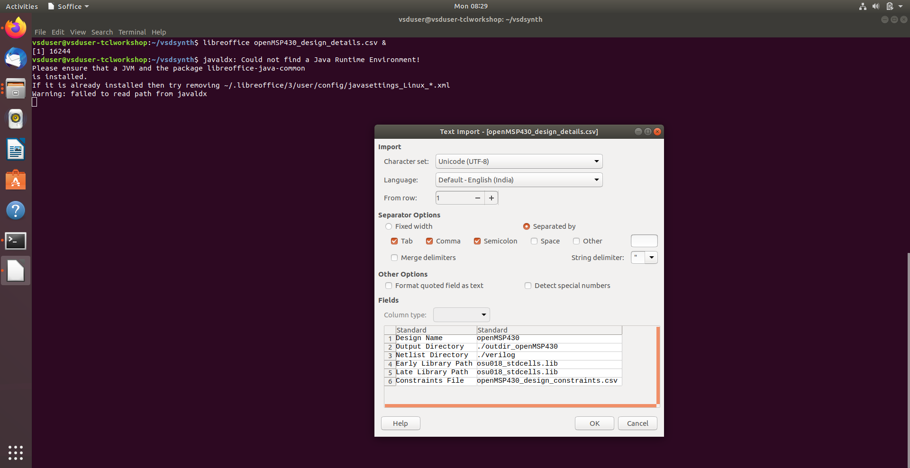
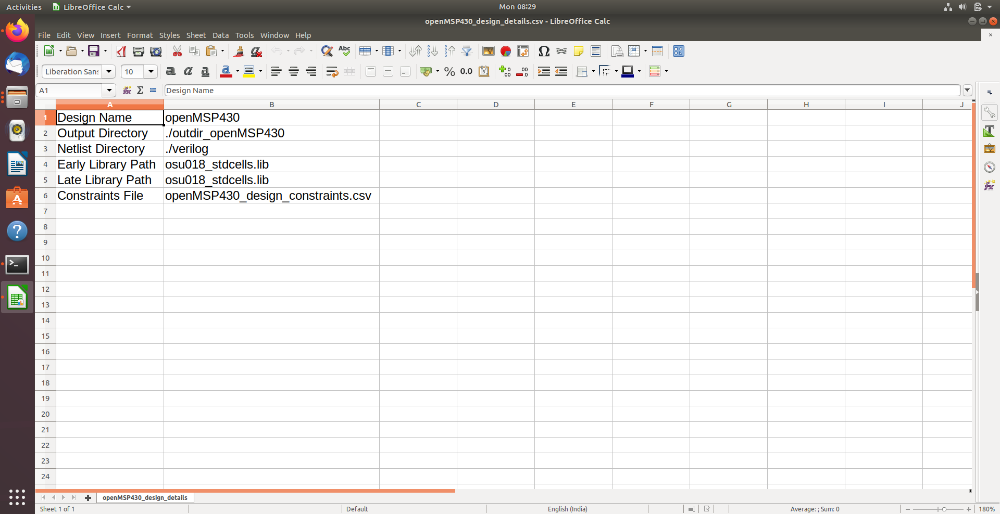
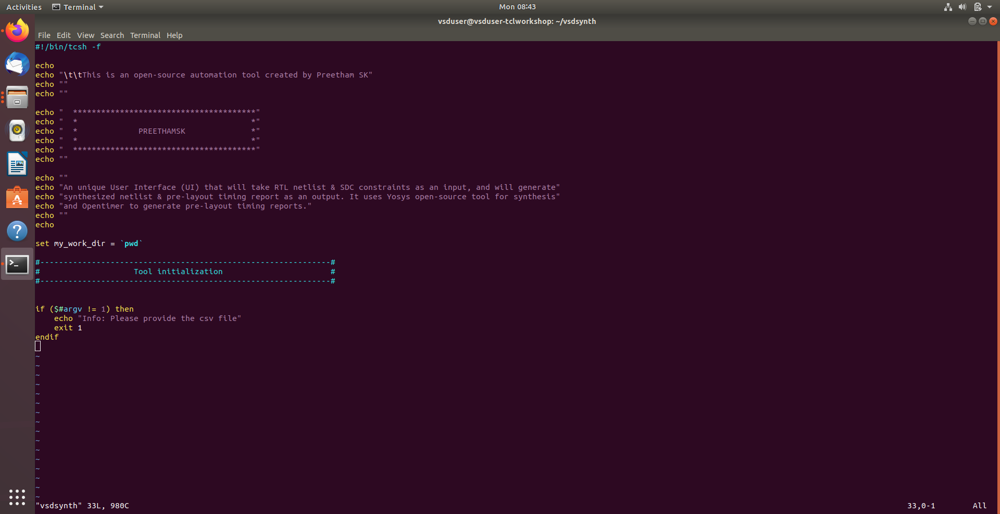
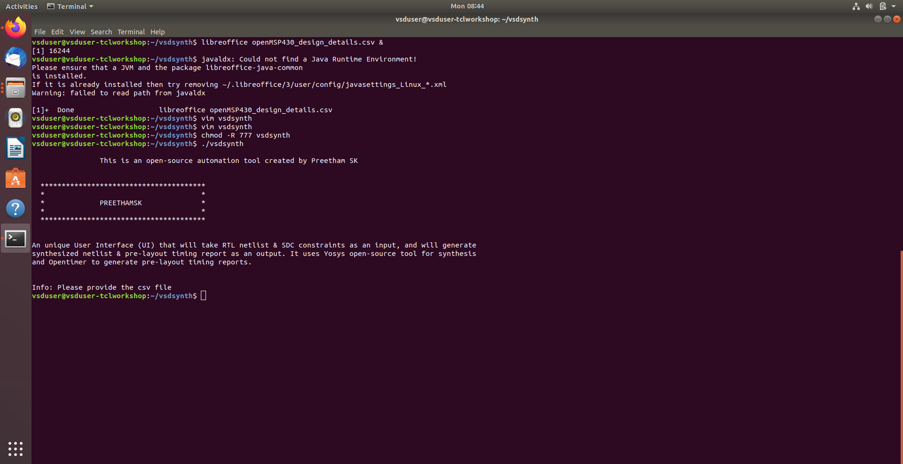
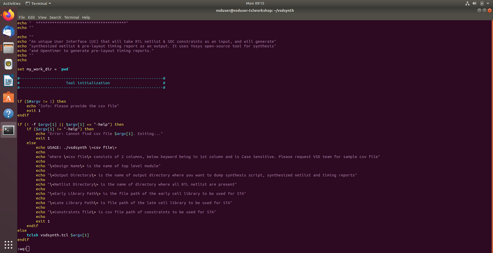
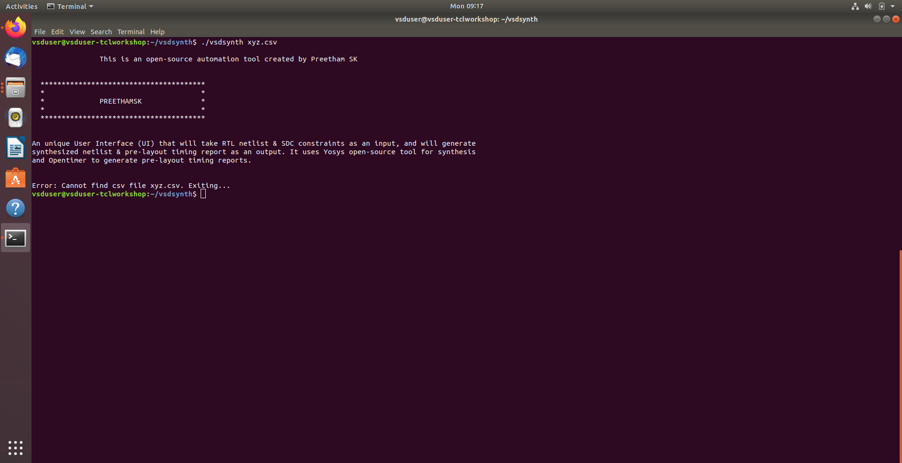
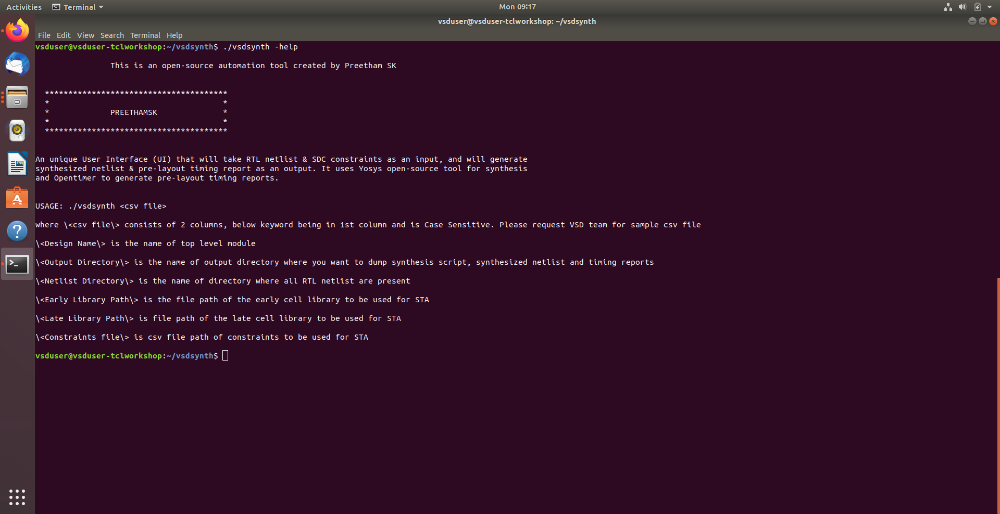

# TCL Toolbox Setup
> CLI Wrapper, Argument Validation & Help Subsystem — VSDSYNTH

<h2>🔍 Overview</h2>

- Built the `vsdsynth` shell-based front end using `tcsh` — transforming the TCL synthesis engine into a structured command-line automation tool with professional CLI behavior.
- Implemented robust argument validation, file existence checks, and a comprehensive `-help` subsystem — ensuring only validated CSV inputs enter the core TCL flow.

<h2>⚙️ Tasks Covered</h2>

| Task | Description |
|:---|:---|
| Design Configuration | CSV-driven variable initialisation, path mapping, environment setup |
| Shell Wrapper & Validation | `vsdsynth` tcsh wrapper, argument checks, safe termination |
| Advanced Parsing & Help | File existence validation, `-help` subsystem, error differentiation |

<h2>📝 Stage Details</h2>

**Task 1 — Design Configuration & Environment Setup** &nbsp;|&nbsp; `CSV` `TCL Variables` `Path Mapping`

Implemented a CSV-driven configuration framework to enable design-agnostic TCL automation. Centralized design metadata in `openMSP430_design_details.csv` — parsed key–value pairs to reliably initialize synthesis variables. Automated directory mapping for RTL sources and output generation. Integrated OSU 0.18µm standard cell libraries via explicit library search paths.

**Task 2 — Shell Scripting & User Input Validation** &nbsp;|&nbsp; `tcsh` `CLI` `Argument Checks`

Developed the `vsdsynth` shell wrapper using `tcsh` to control the end-to-end automation flow. Implemented argument validation to verify presence of the mandatory CSV file before execution. Handled missing-input scenarios with corrective usage instructions and safe termination. Applied executable permissions to finalize the script as a Linux CLI utility.

**Task 3 — Advanced Argument Parsing & Help Subsystem** &nbsp;|&nbsp; `File Validation` `-help` `Error Handling`

Added file existence checks to verify validity of the provided CSV before parsing. Developed a dynamic `-help` interface covering required CSV keywords, formats, and directory expectations. Introduced granular error handling to differentiate between missing inputs and invalid file paths. Integrated the shell pre-processing layer with `tclsh` — ensuring only validated data enters the core flow.

<h2>🖼️ Implementation Results</h2>

### Design Configuration & Environment Setup

### Shell Scripting & User Input Validation

### Advanced Argument Parsing & Help Subsystem

<h2>🔗 Navigation</h2>

[Back to Repository Overview](../README.md) &nbsp;|&nbsp; [Next : 02 : CSV Parsing](../02%20:%20CSV%20Parsing)
