# Synthesis & Error Handling
> Yosys Script Generation, Hierarchy Validation & Graceful Error Handling — VSDSYNTH

<h2>🔍 Overview</h2>

- Developed dynamic Yosys synthesis script generation — automating the complete RTL-to-netlist transition with absolute paths for libraries and Verilog sources.
- Engineered fail-safe routines with automated hierarchy validation and real-time log scanning — ensuring only structurally sound RTL enters synthesis and preventing invalid netlist generation.

<h2>⚙️ Tasks Covered</h2>

| Task | Description |
|:---|:---|
| Hierarchy Check & Script Generation | Dynamic Yosys script generation, structural hierarchy validation, variable-driven execution |
| Error Handling in Hierarchy Check | Log monitoring, module consistency checks, graceful termination on errors |
| Integrated Synthesis Error Handling | System traps, heuristic log scanning, actionable CLI feedback |

<h2>📝 Stage Details</h2>

**Task 1 — Hierarchy Check & Synthesis Script Generation** &nbsp;|&nbsp; `Yosys` `TCL` `Hierarchy Check`

Developed dynamic Yosys script generation to automate RTL-to-synthesis transition. Implemented automated resource loading of standard cell libraries and all Verilog sources using absolute paths. Integrated structural hierarchy validation to verify module consistency before synthesis. Leveraged design-specific variables (`$DesignName`, `$NetlistDirectory`) for synchronized, scalable script execution across different projects.

**Task 2 — Error Handling Logic in Hierarchy Check** &nbsp;|&nbsp; `catch` `Log Scanning` `Graceful Termination`

Implemented automated log monitoring to capture Yosys hierarchy reports for real-time scanning. Developed proactive error detection to identify critical RTL issues — including module re-definitions and missing sub-modules. Engineered graceful script termination to halt execution upon detecting hierarchy errors. Leveraged TCL `catch` and pattern matching to flag all hierarchy-related warnings before synthesis proceeds.

**Task 3 — Integrated Synthesis Error Handling** &nbsp;|&nbsp; `System Traps` `Heuristic Scanning` `Flow Protection`

Implemented system traps using TCL `catch` to monitor Yosys calls and prevent tool-wide crashes. Developed heuristic log scanning to detect common synthesis errors — syntax issues, unmapped logic, and missing cells. Engineered graceful flow termination to halt the automation pipeline while preserving output integrity. Enhanced CLI feedback with specific error codes and actionable messages for faster troubleshooting.

<h2>🖼️ Implementation Results</h2>

### Hierarchy Check & Synthesis Script Generation
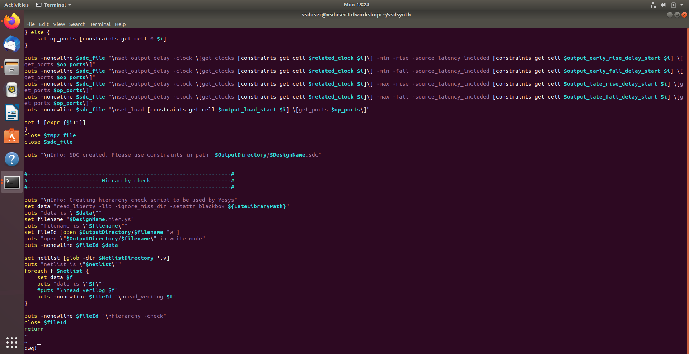
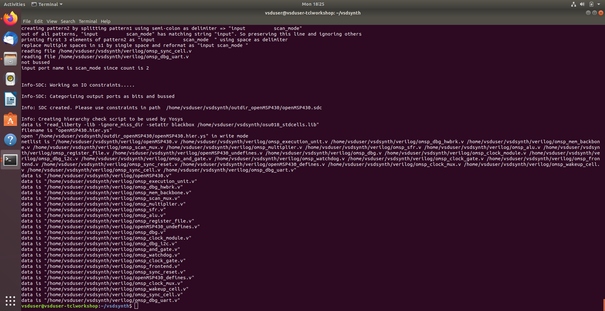

### Error Handling Logic in Hierarchy Check
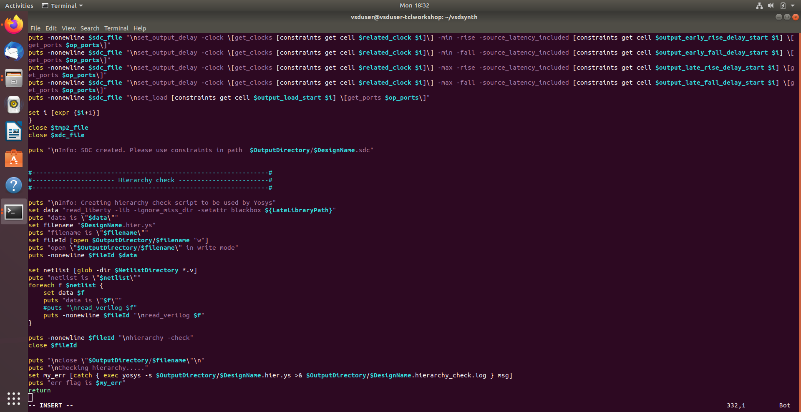

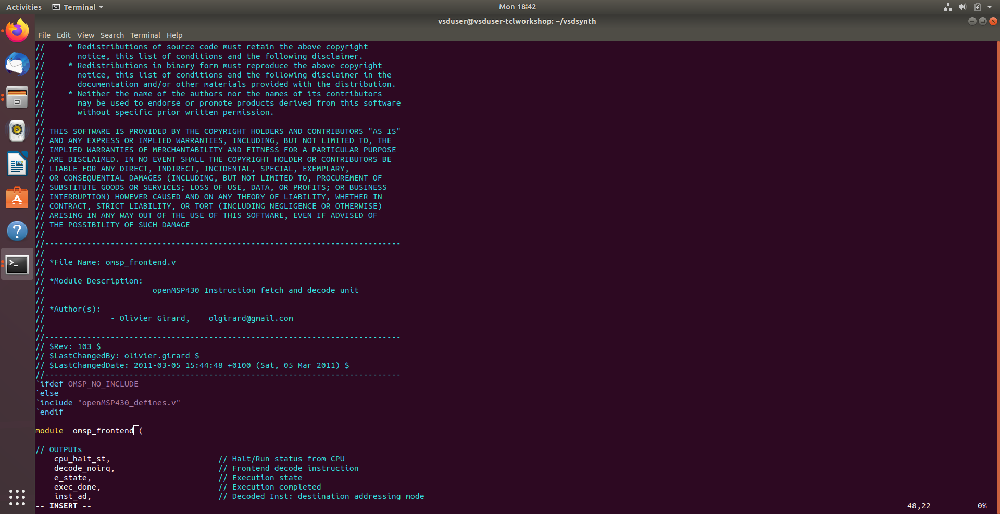
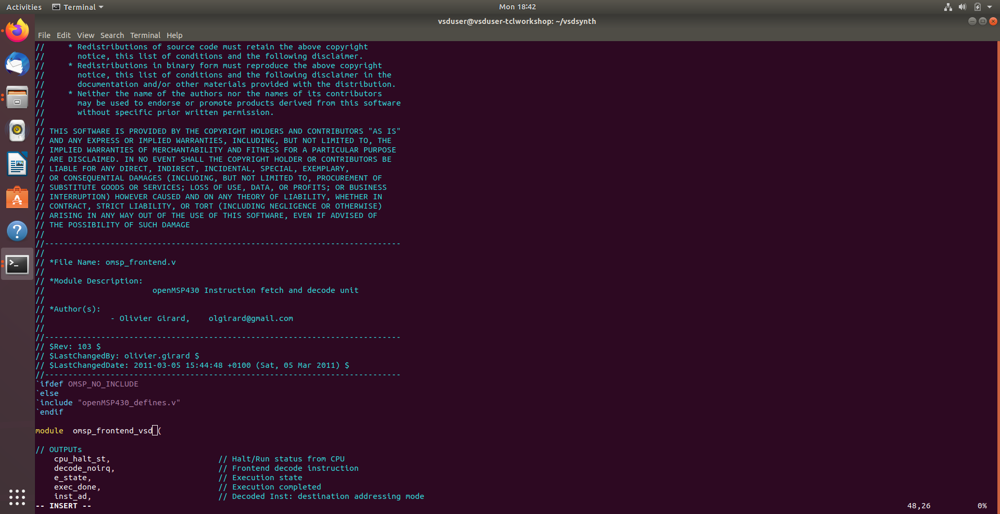
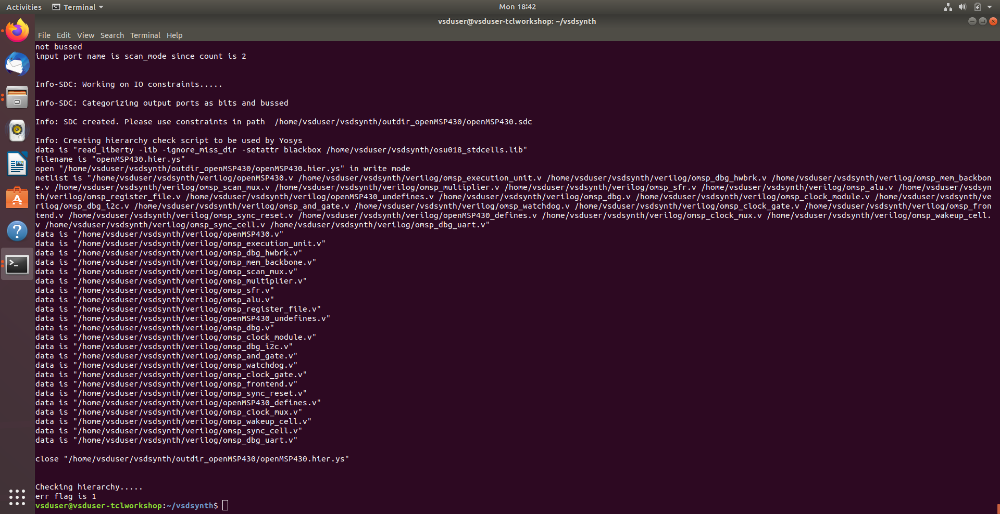
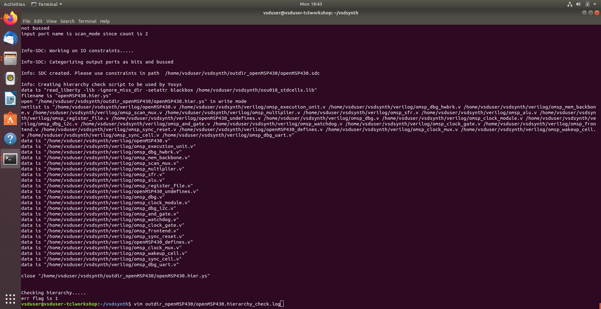
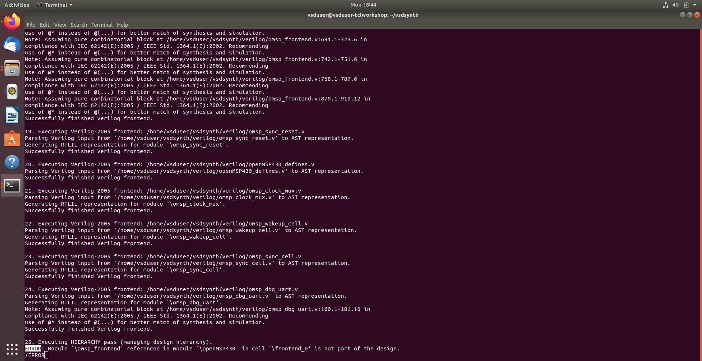

### Integrated Synthesis Error Handling
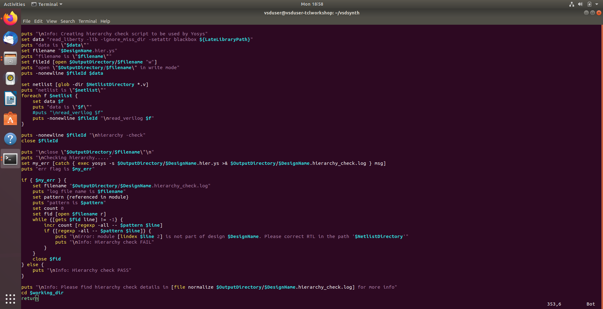
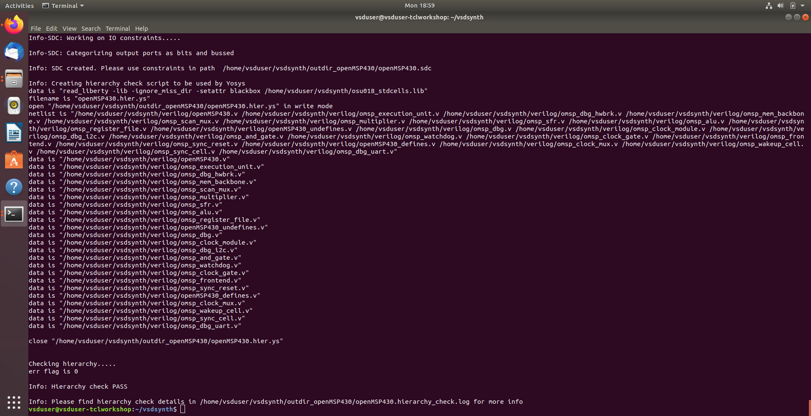
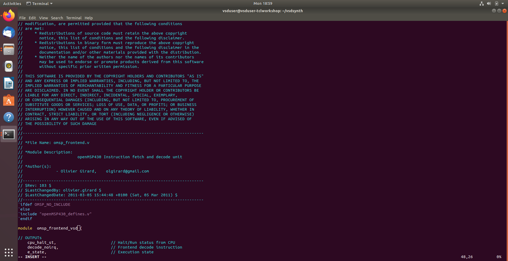
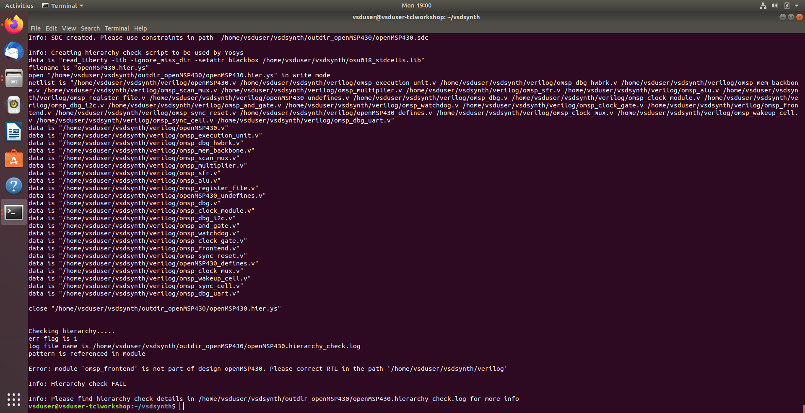

<h2>🔗 Navigation</h2>

[Back to Repository Overview](../README.md) &nbsp;|&nbsp; [Previous : 03 : Constraint Generation](../03%20:%20Constraint%20Generation) &nbsp;|&nbsp; [Next : 05 : QoR Generation](../05%20:%20QoR%20Generation)
